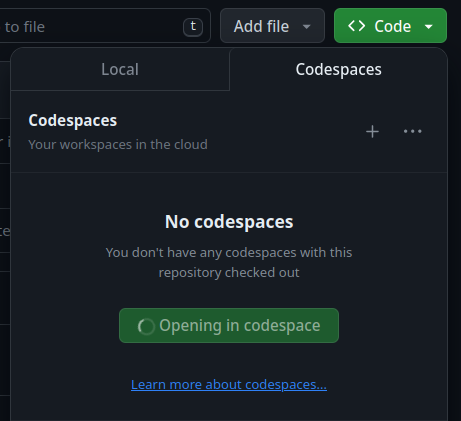
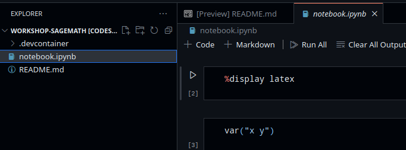
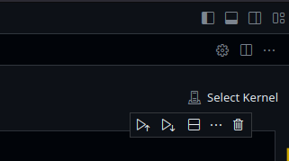
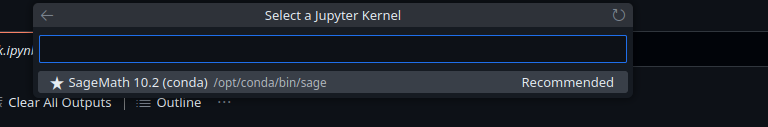

## Codespace startup

Start up a codespace from code > codespaces > new codespace

After a few minutes, there should be VSCode running in the browser, open the notebook:

In the top right corner, select the kernel for the jupyter notebook:

The prompt will appear at the top, where you choose "jupyter kernel > SageMath ...."

